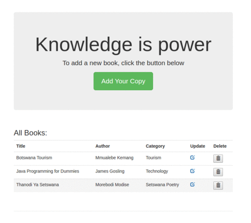

# book-manager-mongodb-nodejs
A simple application to demostrate CRUD functions in MongoDB using Mongoose and ExpressJS in NodeJS

#Demo


#Environment Set-up
<ul>
  <li>You must have NodeJS installed</li>
  <li>This demo was inspired by </li>
  <li>Check <a target="_blank" href="https://glacial-falls-62616.herokuapp.com/">demo</a> on Heroku </li>
</ul>

#Instructions
<ul>
  <li>Download the zip file/clone the repo and extract it to your preffered location </li>
  <li>Open the extracted folder in your favorite Text Editor, the code has been well commented</li>
</ul>

```
  cd book-manager-mongodb-nodejs
  npm install
```

<ul>
  <li>Once all dependencies are installed, </li>  
  <li>Run the command below while you're within the project's root directory</li>
</ul>

```
  run node server
```

